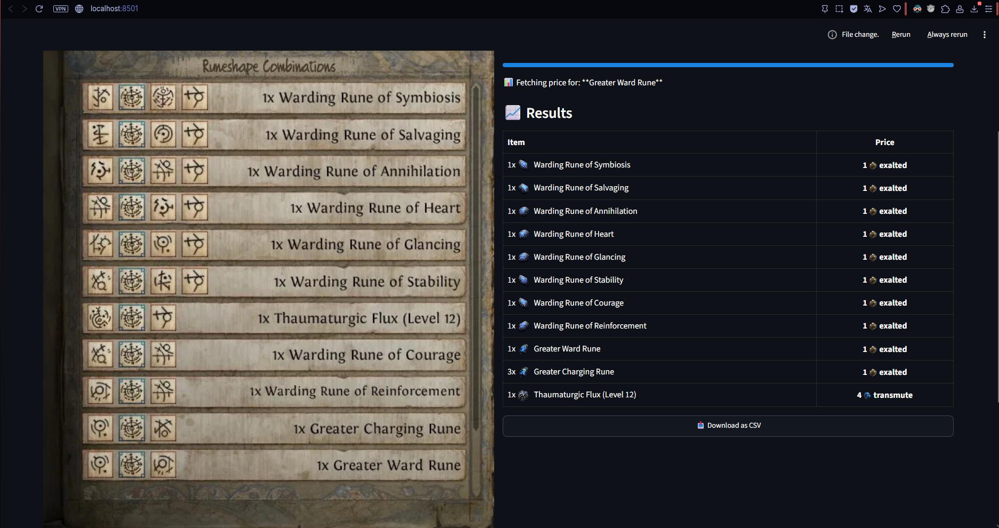
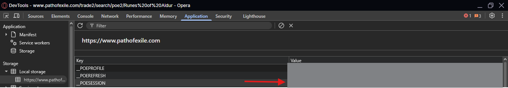
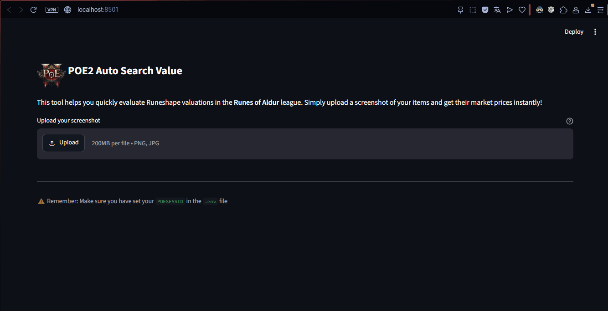

<h1>
  
  Path of Exile 2 - Auto Search Value
</h1>

This is an script in python made to read an Image you send in Input Folder and then consult each Item value.
Made to better evaluate all the Runeshape Valuations in the Runes of Aldur league mechanic to optmize your selection without need to consult each Item in the market.




## ⚙️ How to Run It?

**Step 1: Set up Authentication**

First access GGG poe Trade site and authenticate your account:
https://www.pathofexile.com/trade2/search/poe2/Runes%20of%20Aldur

Open DevTools and grab your `POESESSID` 


Then set it inside the `.streamlit\secrets.toml` file.
```
POESESSID="{YOUR_SESSION_ID}"
```

**Step 2: Install Dependencies**


Run this in CMD with the project opened:
```
pip install -r requirements.txt
```
*You do need to instal python in your PC in order to run this command

**Step 3: Run the Script**

Execute the Poe2-AutoValue.bat file and let the CMD Open then acess the link in your browser.

.Bat script:
```
@echo off
cd /d "%~dp0"
call .\.venv\Scripts\activate.bat
streamlit run app.py
```



---

## 📐 Architecture Overview

---

```
[ Image File / Screenshot ]
         │
         ▼
  ┌─────────────────┐
  │   OCR Module    │  (pytesseract / easyocr)
  │  Read & extract │
  │   raw text      │
  └────────┬────────┘
           │  raw string
           ▼
  ┌─────────────────┐
  │  Parser Module  │  Split by \n → clean → filter
  │  text → list[]  │  e.g. ["Chaos Orb", "Exalted Orb", ...]
  └────────┬────────┘
           │  list of item names
           ▼
  ┌──────────────────────┐
  │  Trade API Module    │  POST /api/trade2/search/{league}
  │  Query PoE2 market   │  GET  /api/trade2/fetch/{ids}
  │  per item name       │
  └────────┬─────────────┘
           │  price data per item
           ▼
  ┌─────────────────┐
  │  Output Module  │  Print table to terminal
  │  Format & show  │  (or export to CSV/JSON)
  └─────────────────┘
```

---

## 🗂️ Project Structure

---

```
poe2-price-checker/
│
├── .env                  # POESESSID=your_cookie_here
├── main.py               # Entry point
├── ocr.py                # OCR: image → raw text
├── parser.py             # Parser: raw text → clean item list
├── trade_api.py          # API: item name → price
└── output.py             # Formatter: print results table
```

---

## 🔍 Module Breakdown

### 1. `ocr.py` — Image Reading

```python
# Uses easyocr to extract text from image
import easyocr
from PIL import Image

def read_image(image_path: str) -> str:
    """Extract text from image using easyocr."""
    reader = easyocr.Reader(['en'])
    result = reader.readtext(image_path)
    # Extract text from result tuples
    raw_text = '\n'.join([text[1] for text in result])
    return raw_text
```

**Key considerations:**
- Uses `easyocr` for robust text extraction
- English language support configured
- Handles both clean and noisy in-game screenshots
- First execution downloads language models (~100MB)

---

### 2. `parser.py` — Text to Item List

```python
def parse_items(raw_text: str) -> list[str]:
    lines = raw_text.splitlines()
    items = []
    
    for line in lines:
        cleaned = line.strip()
        if cleaned:                    # skip blank lines
            items.append(cleaned)

    # Remove known OCR artifacts
    items.remove("Rueshape Cowbinatidws")
    
    # Filter out unwanted items
    items = [
        item
        for item in items
        if (
            item.upper() not in ("IX", "1X")
            and "unique" not in item.lower()
            and "Rueshape" not in item.lower()
            and "Runeshape" not in item.lower()
        )
    ]
    
    # Clean quantity prefixes
    items = [
        item.replace("Ix ", "").replace("1x ", "").strip()
        for item in items
    ]

    return items

# Example output:
# ["Thaumaturgic Flux (Level 12)", "Warding Rune of Reinforcement", "Greater Charging Rune", "Greater Ward Rune", "Chaos Orb"]
```

**Key considerations:**
- Filters out OCR artifacts and UI elements
- Removes quantity prefixes ("Ix", "1x") from item names
- Excludes "unique" and "Runeshape" related entries
- Cleans up common OCR typos specific to this use case

---

### 3. `trade_api.py` — Fetch Prices

The PoE2 trade site uses a **two-step API**:
https://www.pathofexile.com/api/trade2/search/poe2/Runes%20of%20Aldur
> Returns us the IDs of all listings in the POE2 Market inside Runes of Aldur League ordered by Price Ascending.

https://www.pathofexile.com/api/trade2/fetch/{Item_ID}
> Consults out the results in last endpoint to grab the valuation of the listing of the Item.


### 4. `output.py` — Display Results

**Example output:**
```
╭───────────────────────────────┬───────────╮
│ Item                          │ Price     │
├───────────────────────────────┼───────────┤
│ Warding Rune of Symbiosis     │ 1 exalted │
│ Warding Rune of Salvaging     │ 1 exalted │
│ Warding Rune of Annihilation  │ 1 exalted │
│ Warding Rune of Heart         │ 1 exalted │
│ Warding Rune of Glancing      │ 1 exalted │
│ Warding Rune of Courage       │ 1 exalted │
│ Warding Rune of Reinforcement │ 1 exalted │
│ Greater Charging Rune         │ 1 exalted │
│ Greater Ward Rune             │ 1 exalted │
│ Warding Rune of Stability     │ 2 exalted │
│ Thaumaturgic Flux (Level 12)  │ 3 regal   │
╰───────────────────────────────┴───────────╯
```

---

## ⚠️ Important Notes & Limitations

| Topic | Note |
|-------|------|
| **Authentication** | Requires `POESESSID` cookie from your PoE account login |
| **Rate limiting** | GGG's API is strict — add delays between requests or risk temporary bans |
| **OCR accuracy** | In-game screenshots may need preprocessing (contrast, crop) for clean results |
| **Item name matching** | OCR typos may cause `0 results` — consider fuzzy matching as a fallback |
| **API stability** | GGG may change endpoints without notice; no uptime guarantee |
| **Currently Needs to specify the print path** | In order to run this python app you need to pass out the path when calling main.py |
